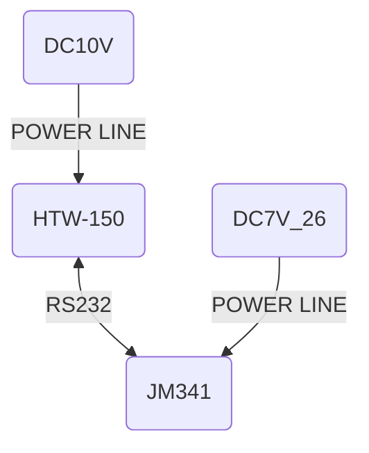

# htw150_data_display
## 简介
本脚本通过读取数据记录仪里面的txt文本，将电子台秤数据以图表形式展示。

## 设备
1. 坤宏 电子台秤 HTW-150
2. 竞美 工业串口数据记录仪 JM341

## 设备配置
### HTW-150配置
P1-G XXX=OFF

P1-Kg XXX=OFF

P1-Lb XXX=ON

P1-Oz XXX=OFF

P2-FC X=6

### JM341配置
配置拨码开关：RS232、时间戳开、工作

波特率选择开关：9600

## 接线定义

## 操作指引
将名称为“run.py”或“run.exe”文件复制至数据记录仪文本所在的根目录，然后双击运行。
